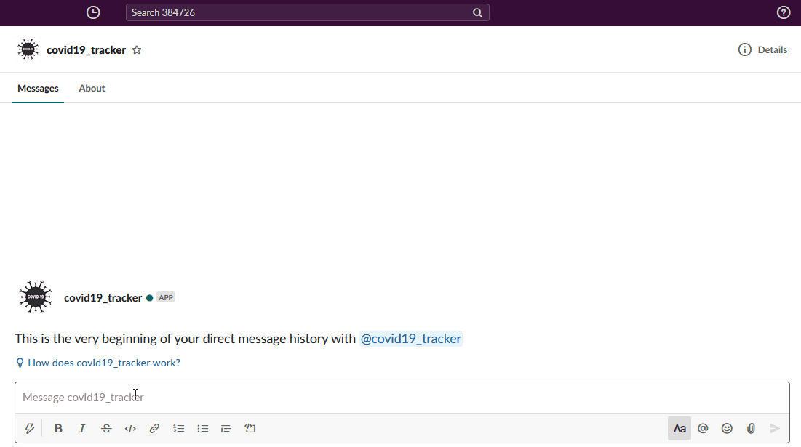

# COVID-19-Tracker-Bot

You can find below folder 
1. COVID-19-Tracker-Chatbot_Code (RASA chatbot)
2. flask_server (Image service web app)

Prerequisite:
  * rasa
  * python 3.6
  * docker
  * matplotlib 
  * datetime
  * pandas
  * seaborn 
  * spacy
  * en_core_web_sm spacy model

## How to RASA Bot:
Go to COVID-19-Tracker-Chatbot_Code folder and execute following commands.

#### RUN RASA Custom Action server ##
`rasa run actions`

RASA actions runs on `5005` port

#### RUN RASA chatbot ##
`rasa run`

RASA chatbot runs on `5055` port

## How to run Duckling for Named Entity Recognition:
Install the docker in your OS

#### Pull rasa duckling image from Docker Hub ##
`docker pull rasa/duckling`

#### RUN duckling docker image ##
`docker run <image-id>`

Duckling docker container runs on `8000` port

## How to Run Image Serving Flask App :
Go to flask_server folder

#### Run Image Serving Flask web app ##
`python run.py`

Flask app runs on `5020` port

